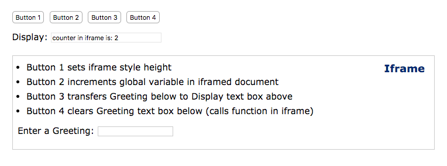

### iframes cross-document communication
- communicate btw documents using iframes

#### access iframe and its docs and content
- communicate with iframe and its document inside by
- getting an iframe reference
- get and set iframe properties
- access variables in iframe
- invoke function in iframe





### getting a ref, setting propertie - 'document.getElementById'
- then set properties

```
    // reference to iframe with id 'ifrm'
    var ifrm = document.getElementById('ifrm');
    ifrm.style.width = '400px';      // set width
    ifrm.src = 'newpage.html';      // set src to new url

```

Getting references to the iframe document window and document object

```
    // using reference to iframe (ifrm) obtained above
    var win = ifrm.contentWindow;    // reference to iframe's window
    
    // reference to document in iframe
    var doc = ifrm.contentDocument? ifrm.contentDocument: ifrm.contentWindow.document;
    
    // reference to form named 'demoForm' in iframe
    var form = doc.getElementById('demoForm');

```


Once you got access to window and document objects, then you can access just about any object or property in the iframed document.

ex:

```
     // attach handlers once iframe is loaded
     document.getElementById('ifrm').onload = function() {

     // get reference to form to attach button onclick handlers
     var form = document.getElementById('demoForm');
    
     // set height of iframe and display value
     form.elements.button1.onclick = function() {
        var ifrm = document.getElementById('ifrm');
        var ht = ifrm.style.height = '160px';
        this.form.elements.display.value = 'The iframe\'s height is: ' + ht;
     }
    
     // increment and display counter variable contained in iframed document
     form.elements['button2'].onclick = function() {
        // get reference to iframe window
        var win = document.getElementById('ifrm').contentWindow;
        var counter = ++win.counter; //  increment
        this.form.elements['display'].value = 'counter in iframe is: ' + counter;
     }
    
     // reference form element in iframed document
     form.elements.button3.onclick = function() {
        var re = /[^-a-zA-Z!,'?\s]/g; // to filter out unwanted characters
        var ifrm = document.getElementById('ifrm');
        // reference to document in iframe
        var doc = ifrm.contentDocument? ifrm.contentDocument: ifrm.contentWindow.document;
        // get reference to greeting text box in iframed document
        var fld = doc.forms['iframeDemoForm'].elements['greeting'];
        var val = fld.value.replace(re, '');
        // display value in text box
        this.form.elements.display.value = 'The greeting is: ' + val;
     }
    
     form.elements.button4.onclick = function() {
        // get reference to iframe window
        var win = document.getElementById('ifrm').contentWindow;
        win.clearGreeting(); // call function in iframed document
     }
}


```


