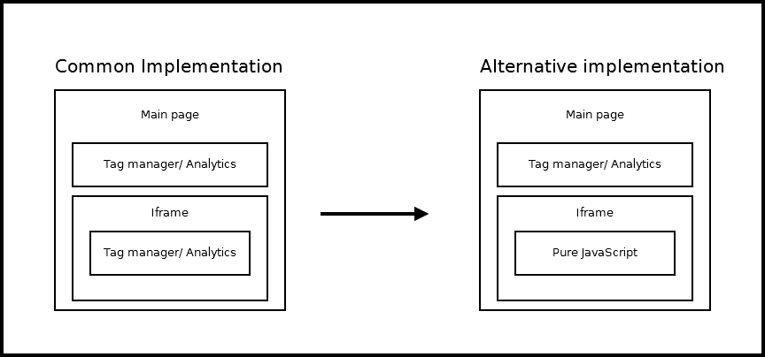
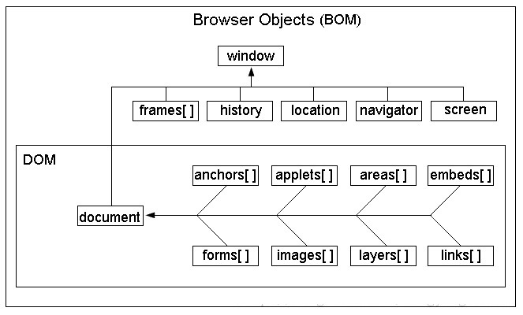

# iframesJS &nbsp; <kbd>:trumpet:</kbd>
- loading separate html files into existing doc
- Other domain loading - nope - ***Same origin Policy** applies here as well.
- But it is possible with ***postMessaging interface*** cross-window messaging &nbsp; :rocket:

- iframe-to-iframe

<kbd>common iframe implementation</kbd>


<br/>

<kbd>BOM</kbd>
<br/>
   


<kbd>ex:</kbd>

```
    <iframe id="ifrm" src="demo.html"></iframe>

```

<kbd>:checkered_flag:</kbd> &nbsp; iframe's src attr specifies ***Url of doc*** to be displayed in iframe
- using more css attrs than iframes attrs
- scrollbars will appear automatically if needed
- use js to set height to remove them

<kbd>:closed_umbrella:</kbd>
```
   iframe {
       border:1px solid #ccc;
       width:80%; height:120px;
   }

```
